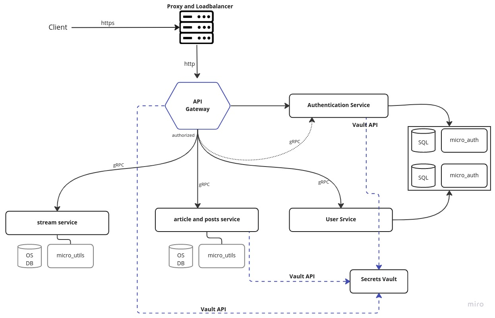

# The Monkeys

Welcome to The Monkeys, an educational and informational blogging platform!

We are dedicated to providing a space for individuals to share their knowledge and experiences on a variety of topics. Our platform is designed to be a resource for people looking to learn new things and expand their understanding of the world.

We invite readers/writers/experts to bring a diverse range of perspectives to the table, share their insights on everything from science and technology to personal development and self-improvement, psychology, philosophy, fashion, health and lifestyle etc.

We believe that learning should be accessible to everyone, and that's why we offer our content. Our platform is open to anyone who wants to read, learn, and grow.

We also believe in the power of community. Our platform encourages engagement and conversation, and we welcome feedback and suggestions from our readers.

Thank you for visiting our platform. We hope you find it informative and educational, and that you come back often to learn and grow with us.

 

# The current architecture diagram.

# Contribution Guidelines:
We're glad you're thinking about contributing to The Monkeys. If you think something is missing or could be improved, please open issues and pull requests. If you'd like to help this project grow, we'd love to have you. To start contributing, check the [Contributing Guidelines](contribution/contribution.md).

 # Native installation steps
 1. Move to the the_new_project directory
   - `cd the_new_projects`

 2. Export scripts directory:
   - `export MONKEY_SCRIPTS=$PWD/scripts/`
 
 3. Build the services:
    * On docker
    `./scripts/build.sh`
    * On Linux
    `sudo -E ./scripts/build.sh`
  
 4. Install services and other core components:
    * On Docker
    `./scripts/install.sh`
    * On Linux
    `sudo -E ./scripts/install.sh `

 5. Install services and other core components:
    * On docker
     `./scripts/uninstall.sh`
    * On linux
     `sudo -E ./scripts/uninstall.sh `
